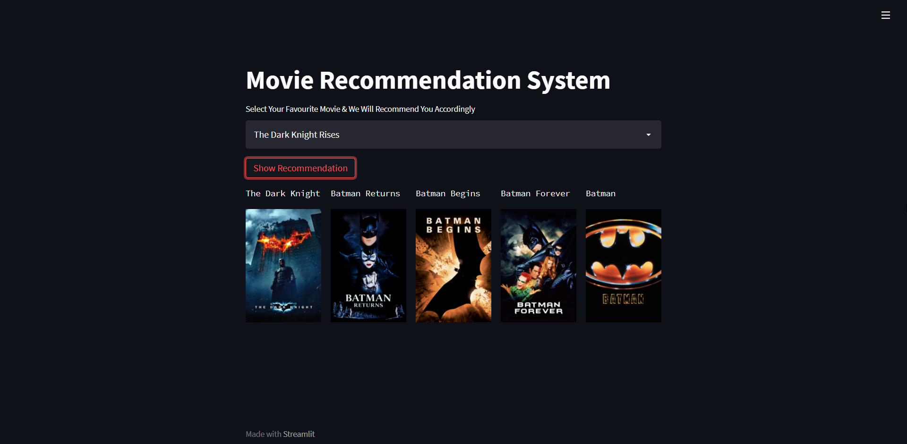

# Movie-Recommendation-System
This is an complete End-to-End movie recommendation system which will help you to save your time to find similar movies which is related to the previous movie you watched.

# CHECK OUT WEB-APPLICATION:

https://movies-recommend-infinitycodex.herokuapp.com/

# TECHNOLOGIES USED:

- Python
- Anaconda
- NLP
- Streamlit

# APPROCH & METHODOLOGY FOR THIS PROJECT:

At first I imported all the essential libraries such as Pandas, Numpy, Flask, Tensorflow...etc. Then I started to create a our model.
After that I took the favourite flim of user. Then I passed it to the Prediction function in which with the help of cosine similairty we are predicting the top 5 similar flims which user will enjoy.

# APPLICATION PREVIEW:

Example:

